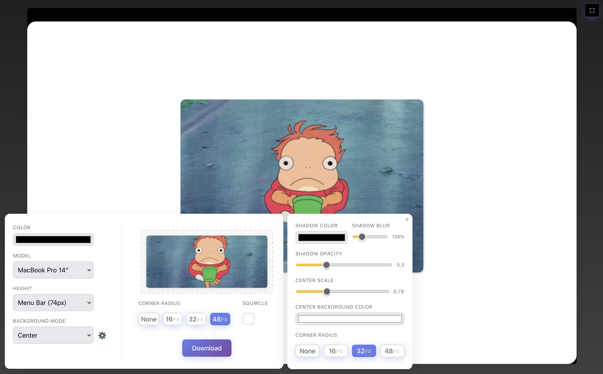
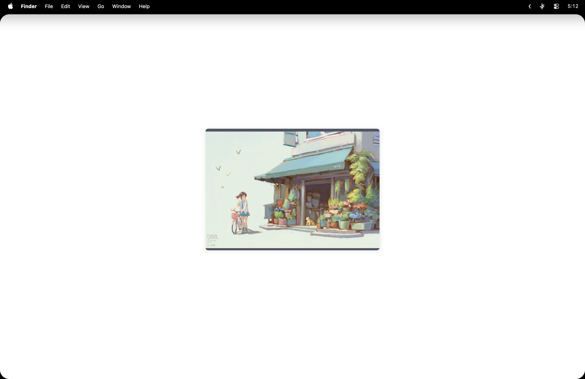

# Notch Paper

A simple web app for Mac users to create wallpapers that hide the notch with a black bar and add rounded corners.

Try it out [live](https://finchett.github.io/notch-paper/).

## Example

*Image credit: [Krenz Kushart](https://www.instagram.com/krenzcushart/)*

## Installation

1. Clone the repo: `git clone https://github.com/finchett/notch-paper.git`
2. Install: `pnpm install`
3. Run: `pnpm dev`
4. Open in browser

## Usage

1. Upload an image
2. Select Mac model
3. Adjust settings (bar height, color, corner radius)
4. Preview and download

## Contributing

Fork, make changes, submit PR.

## License

MIT
